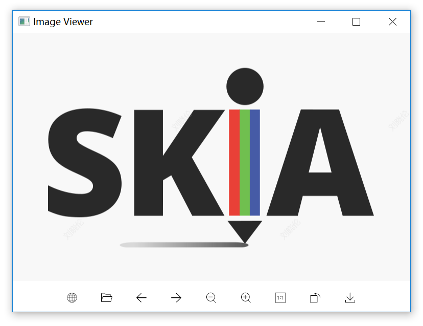

# ImageViewer

An image viewer powered by Skia.

# Features

- Support most of the images formats : png, jpeg, gif ...
- Image zoom
- Image rotate
- Drag to move image
- Previous image and next image in a directory
- Image watermark
- Image from http/https url
- Image save to disk
- Multi language support
- Very fast
- Low memory and CPU useage
- Only one executeble file less than 6M

# In Progress

- [ ] Loading Tip
- [ ] Mac OS Support ( Only Windows Just Now )
